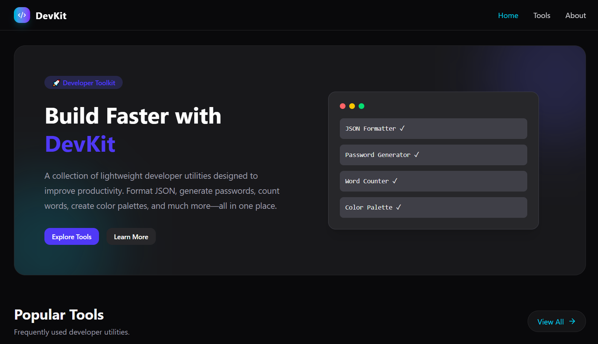
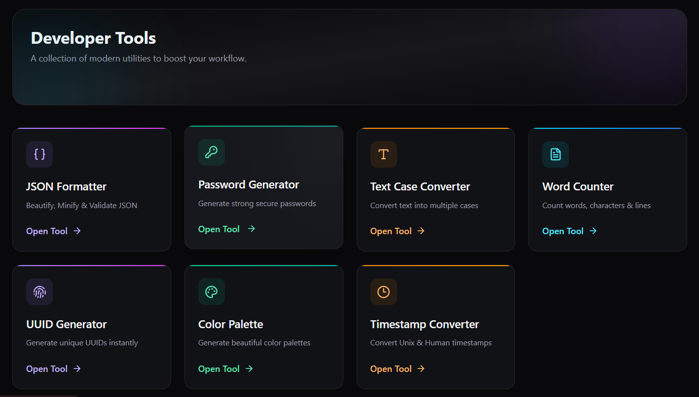
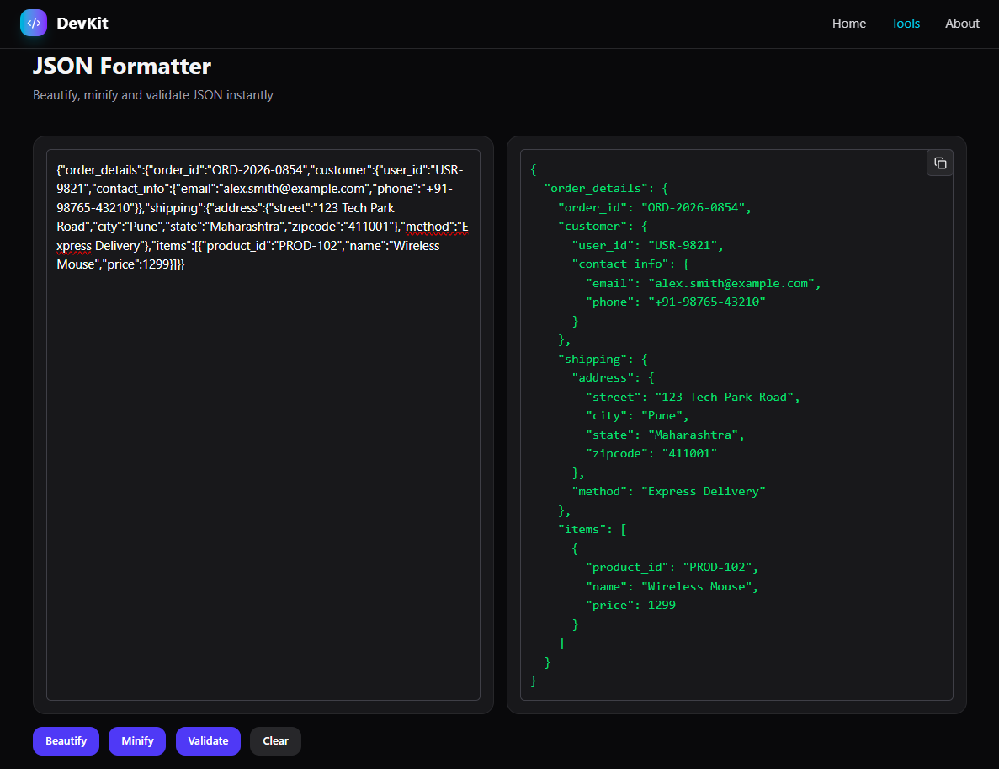

# 🚀 DevKit

A modern all-in-one developer toolkit built with React, Vite, and Tailwind CSS that combines essential productivity utilities into a fast, responsive, and developer-friendly web application. DevKit helps developers perform common development tasks without switching between multiple websites or tools.

> Designed for speed, clean UI, and everyday developer productivity.

---

## 🌐 Live Demo

🔗 https://devkit-one-lac.vercel.app/

---

# ✨ Features

- Lightning-fast Vite application
- Modern responsive UI
- Mobile-first responsive design
- One-click copy functionality
- Client-side processing (where applicable)
- Optimized production build
- Reusable component architecture
- Clean and scalable folder structure

### Included Developer Tools

- JSON Formatter
- UUID Generator
- Password Generator
- Timestamp Converter
- Text Case Converter
- Color Palette Generator
- And Word Counter

---

# 🛠 Tech Stack

## Frontend

- React
- Vite
- JavaScript
- Tailwind CSS
- React Router
- React Icons
- React Hot Toast

## Deployment

- Vercel

---

# 🏗 Architecture Overview

```

Browser
    │
    ▼
React + Vite
    │
    ▼
React Router
    │
    ▼
Tool Pages
    │
    ▼
Reusable Components
    │
    ▼
Utility Functions
    │
    ▼
Instant Client-side Processing

```

The application follows a modular architecture where every tool is isolated, reusable, and easy to extend. Shared UI components and utility functions reduce duplication while keeping the codebase maintainable.

---

# 📸 Screenshots

## Home



---

## Tool Dashboard



---

## Example Tool



---


---

# 📖 API Documentation

This project is completely frontend-based.

All developer tools execute directly in the browser without requiring a backend server.

No external API is required for the core functionality.

---

# 🚀 Future Improvements

- Additional developer utilities
- History for previously generated results
- Import / Export support
- Keyboard shortcuts
- Favorites system
- Tool search improvements
- Accessibility enhancements

---

# 📄 License

MIT License

---

# 👨‍💻 Author

Nikhil Vishwakarma

[Portfolio](https://portfolio-nikhil077.vercel.app/)

[GitHub](https://github.com/nikhilvishwakarma077)

[LinkedIn](https://www.linkedin.com/in/nikhil-vishwakarma-874776376)

nikhilvishwakarma7707@gmail.com

---

## ⭐ Support

If you found this project useful, consider giving it a star.